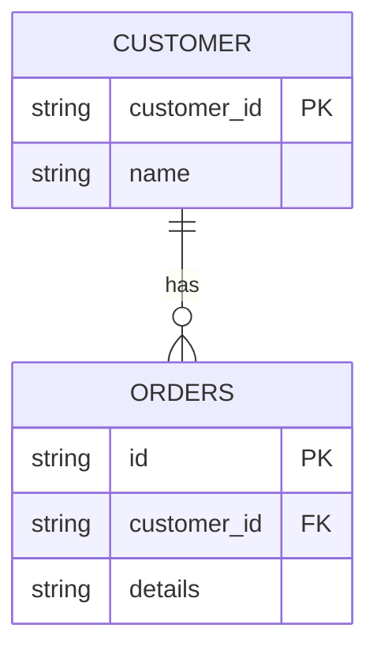
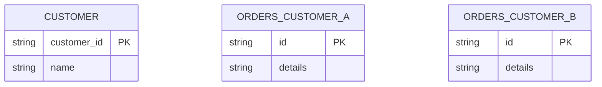

# Multi-Tenant Data Segregation Strategies for SaaS with PostgreSQL/MySQL and Elasticsearch

---

## Table of Contents

1. [Introduction and Problem Statement](#introduction-and-problem-statement)
2. [Data Segregation Approaches](#data-segregation-approaches)
   - [Shared Table / Shared Index](#shared-table--shared-index)
   - [Separate Table / Separate Index](#separate-table--separate-index)
3. [Performance Analysis](#performance-analysis)
4. [Resource Isolation](#resource-isolation)
5. [Latency Guarantees and Industry Practices](#latency-guarantees-and-industry-practices)
6. [Elasticsearch-Specific Considerations](#elasticsearch-specific-considerations)
7. [Industry Research](#industry-research)
8. [Decision Tree and Operational Playbook](#decision-tree-and-operational-playbook)
9. [References](#references)
10. [Final Review and Recommendations](#final-review-and-recommendations)

---

## Introduction and Problem Statement

Multi-tenant SaaS platforms must rigorously segregate customer data while providing consistent, efficient query performance, and keeping operational complexity in check.  
**Goals:**  
- Guarantee that no customer can ever access another's data (logical and possibly physical isolation)
- Keep CPU, RAM, and IO usage low  
- Ensure similar and predictable latency for all customers  
- Retain operational and scaling simplicity

**Challenge:**  
Striking the right balance between isolation, performance, and manageability as the customer base grows and customer workloads diverge.

---

## Data Segregation Approaches

### 1. Shared Table (SQL) / Shared Index (Elasticsearch)

**Architecture:**  
- All tenant data in one table or index, with a mandatory `customerId` (or equivalent) field  
- SQL: All queries filtered by `customerId`; composite/covering indexes for filter/search columns  
- Elasticsearch: All documents tagged with a tenant key; reads/writes may route using `customerId`

#### Diagram  


**Assumptions to Challenge:**  
- Automatically "safe" as long as filtering applied: This is vulnerable to application bugs or missed WHERE/routing clauses.
- “Easier to operate”: Many organizations are eventually forced to build automation for separating “big” tenants.

**Operational Considerations:**  
- *Application and DB query safety:* Use DB-level Row Level Security (PostgreSQL RLS), and programmatic query checks.  
- *Index design:* Composite indexes; possible table partitioning (see below).  
- *Schema lifecycle:* Easier to manage one schema, but migrations or outages affect all tenants.

---

### 2. Separate Table / Separate Index Per Customer

**Architecture:**  
- Each tenant receives a dedicated table (SQL) or index (Elastic), often using a template schema.
- Usually implemented for regulatory isolation, or when a tenant outgrows the shared model.



**Challenged Assumptions:**  
- “Most secure”: True if tenant object names are not guessable and there are no cross-object bugs.
- “Best for all scales”: False; it is not maintainable for thousands of tenants due to DB metadata and ops overhead.

**Operational Considerations:**  
- *Provisioning rate limits*; automation required to create and migrate schemas.  
- *Object (table/index) count limits* in RDBMS and clusters.  
- *Schema consistency* can be harder to guarantee.

---

## Performance Analysis

#### 1. Why can single table + customerId index match/approach separate table performance?

- SQLite, PostgreSQL, and MySQL store B+ Tree indexes: for a composite index such as `(customerId, created_at)`, all data for the same tenant is logically contiguous within the index tree’s leaf pages.  
- Per the [Indexes (PostgreSQL official documentation)](https://www.postgresql.org/docs/current/indexes.html), seeks are O(log N); the database can **quickly locate the range for a single tenant** using the index, even among millions of rows.
- Only the index structure’s top levels grow with database size; leaf page access is localized if buffer pool is large enough.

#### 2. Deeper Dive: B+ Tree Indexes

- Each node points to a sorted range; only leaf nodes actually store row pointers/primary keys.
- **Selects with full prefix (customerId=X)**: scan only the relevant subrange.
- **Index maintenance** (inserts/updates) cost grows as the total row count and write rate grow.
- **Deletes**: May cause internal index fragmentation, requiring periodic vacuum/defragment (see VACUUM in PostgreSQL, OPTIMIZE in MySQL/Elastic).

#### 3. Partition Pruning + Sharding

- *Table Partitioning* (PostgreSQL, MySQL):  
  - Splits a logical table into physical partitions (e.g., by customerID or range/hash of customerID)
  - [Pruning](https://www.postgresql.org/docs/current/ddl-partitioning.html): optimizer directs queries to only the relevant partitions, reducing IO
  - Trade-off: Too many partitions have the same metadata overhead as too many separate tables

- *Application-level Sharding*:  
  - Split large data across DB instances/clusters
  - Often used as a final scale-up: Stripe/GitHub/Shopify all use sharding when cluster size or tenant load exceeds the limits of a single cluster

#### 4. Row Size Variance and Hot Tenants

- **Large row/tenant effect**: If one tenant dominates row count, index page cache, or IO, that tenant’s queries, data changes, and maintenance operations can dominate system resources (see also [noisy neighbor](#resource-isolation)).  
- **In shared tables or indexes,** the largest tenants’ growth *does* risk slowdowns for smaller tenants, especially during data loads, range scans, vacuums, or backup.

---

## Resource Isolation

### Core Question:  
**If customer A runs a heavy query, can customer B experience increased latency?**

**Short answer:**  
- **Yes, in shared arrangements** (and often even with separate tables/indexes sharing hardware), customer B can experience higher latency due to resource contention.

### Types of Isolation

| Type             | Shared Table/Index | Separate Table/Index | Dedicated Infra   |
|------------------|-------------------|---------------------|-------------------|
| Data             | Logical (enforced by code/query) | Physical            | Physical          |
| Compute (CPU/RAM)| Shared            | Shared (unless on separate machine) | Physical |
| Storage (Disk IO)| Shared            | Shared (unless on separate disk)    | Physical |

### Key Resource Contention Problems

- **Noisy Neighbor Problem:**  
  One tenant’s workload (complex queries, huge writes, mass deletes) can claim CPU, saturate memory buffers, or hog disk IO, increasing latency for others. Present in all shared-medium systems.
- **CPU Saturation:**  
  A single tenant’s queries utilize most CPU cycles; parallel requests queue up, causing system-wide latency spikes.
- **Cache Pressure:**  
  Large tenant queries evict smaller tenants’ cached data from RAM/buffer pool.
- **Disk IO Contention:**  
  Multiple tenants’ workloads compete for disk throughput (especially problematic for spinning disks but also an issue on SSD arrays if IO path is saturated).
- **Memory Contention:**  
  High working set from one tenant makes buffer hits for others less likely, pushing more reads to disk.
- **Elasticsearch Hot Shard Problem:**  
  Inequal query distribution leads to some shards being constantly accessed (hot), while others are mostly idle. Hot shards cause single-node bottlenecks even in distributed clusters.

---

## Latency Guarantees and Industry Practices

### Can we guarantee identical latency for all customers?

**Unbiased answer:**  
- **No.** In any shared cluster (whether shared table, shared index, or even separate tables/indexes on the same hardware), perfect performance isolation is impossible.

### Why perfect isolation is impossible

- Shared resources (CPU, RAM, IO bandwidth, network, underlying virtualization layers, cloud block storage) are always subject to contention under load.
- Even with OS-level process/container cgroups, certain shared caches and bus contention are impossible to partition perfectly.

### What the industry actually does

**Pragmatic Patterns:**

- **CPU/Mem Headroom:**  
  Always maintain extra capacity to buffer spikes and provide quality of service.
- **Autoscaling:**  
  Set up dynamic scaling for DB/Elastic clusters using cloud-native/managed services to absorb load.
- **Rate Limiting & Query Throttling:**  
  Explicitly limit query concurrency, complexity, and frequency per tenant ([How Shopify Manages Sharding](https://shopify.engineering/how-shopify-manages-sharding)).
- **Circuit Breakers:**  
  Automatic mitigation (kill/timeout/queue queries) on overload or error budgets exceeded.
- **Cache Warming / Hot Loading:**  
  Preload data for frequent tenants after restarts or failovers to minimize their impact on cold start times.
- **Workload Isolation:**  
  Carefully monitor, and where needed, move high-load tenants to isolated resources (see “Graduated Tenants” in industry research below).

---

## Elasticsearch-Specific Considerations

### Improving on Past Weaknesses

1. **Oversharding Explanation**  
   - Official documentation ([Sizing your shards](https://www.elastic.co/guide/en/elasticsearch/reference/current/size-your-shards.html)):  
     Overprovisioning shards (many more shards than hardware can handle efficiently) causes overhead in memory, open file handles, and GC cycles without adding resilience or scale.
   - Each active shard manages internal Lucene resources; idle shards still occupy heap and system resources; leads to cluster instability at high count.

2. **Cluster State Bloat**  
   - Every index and its shards add to the [cluster state metadata](https://www.elastic.co/guide/en/elasticsearch/reference/current/cluster-state.html), which is held in memory on master nodes.
   - Extremely high counts (thousands of indices/shards) slow all cluster state updates, required for even simple index or shard changes.

3. **Lucene Shard Overhead**  
   - *Official numbers for per-shard memory use are not published; avoid hardcoded MB estimates*  
   - Each shard is an independent Lucene instance, with separate memory structures and resources  
   - Shard-level search also means distributed fan-out/fan-in, so too many shards reduces effective parallelism per node.

4. **Routing on customerId**  
   - [Elasticsearch Routing](https://www.elastic.co/guide/en/elasticsearch/reference/current/mapping-routing-field.html): By specifying `routing = customerId`, all of a tenant’s docs live in a limited set of shards (often just one, if many tenants). This allows queries for that tenant to efficiently hit only required shards.

5. **Hot Shard Detection and Rebalancing**  
   - Hot shards are revealed by disproportionate query/search load on specific nodes/shards ([Elasticsearch Monitoring](https://www.elastic.co/guide/en/elasticsearch/reference/current/cluster-health.html)).
   - [Shard Rebalancing](https://www.elastic.co/guide/en/elasticsearch/reference/current/shards-allocation.html): Elasticsearch automatically (or by operator command) migrates shards to balance disk, query, or node resource imbalance, but this may not solve the problem if one tenant’s data volume or search rates remain extreme.

---

## Industry Research

**Caveat:**  
> "Exact architectures are rarely publicly disclosed; conclusions below are based on public engineering blogs, conference talks, and official documentation only."

#### GitHub

- [How GitHub distributes data across MySQL](https://github.blog/2021-11-23-how-github-distributes-data-across-mysql-infrastructure/):  
  GitHub uses logical sharding (by repo, user, org) but NOT a table-per-tenant. Relying on customer IDs and per-shard grouping, with continuous monitoring and migration tools for rebalancing. Large customers may be moved to dedicated shards.

#### Salesforce

- [Salesforce Engineering Blog](https://engineering.salesforce.com/):  
  Multi-tenant data architecture uses logical separation (ORG_ID columns) and shared clusters. Large customers or those with specific regulatory/security requirements may be split out. Heavy use of application-level, metadata-driven controls and background rebalancing.

#### Stripe

- [Database Sharding at Stripe](https://stripe.com/blog/database-sharding-at-stripe):  
  Stripe scales via "Cells": logical, operational, and data segmentation (not per-customer tables) with automated resource controls and background migrations for big customers.

#### Shopify

- [How Shopify Manages Sharding](https://shopify.engineering/how-shopify-manages-sharding):  
  Shopify employs logical sharding, keeping tens of thousands of shops in shared tables. High-volume merchants are "graduated" to dedicated shards (sometimes clusters).

#### Slack

- [Scaling Slack’s Messaging Architecture for Billions of Messages](https://slack.engineering/scaling-slacks-messaging-architecture-for-billions-of-messages/):  
  Slack primarily uses multi-tenant shared tables/indexes, but graduates high-traffic teams to physically isolated infrastructure as needed.

---

## Decision Tree and Operational Playbook

### Decision Tree

```mermaid
flowchart TD
    Start(Start)
    Isolated??([Does tenant require physical or regulatory isolation?])
    Large??([Is tenant workload "very large" compared to others?])
    SharedCount([Total tenants < 1000?])
    UseShared([Use shared table/index])
    UseSep([Use separate table/index])
    Dedicated([Use dedicated infrastructure])

    Start --> Isolated??
    Isolated?? -- Yes --> Dedicated
    Isolated?? -- No --> Large??
    Large?? -- Yes --> Dedicated
    Large?? -- No --> SharedCount
    SharedCount -- Yes --> UseShared
    SharedCount -- No --> UseSep
```

### Migration Strategy

- **Detect tenant growth:** continuously monitor tenant query volume, storage usage, and peak loads.
- **Graduation process:** when a tenant crosses defined thresholds, automate migration to a separate table/index/infrastructure with careful data consistency and minimal downtime (dark launch, database copy, dual writes, switchover).
- **Graceful fallback:** have an explicit path to revert tenant “graduation” in case of migration errors.

### Operational Playbook for Hot Tenants

- **Detection:** alert on per-tenant CPU, IO, memory, query patterns exceeding n-th percentile of typical usage.
- **Mitigation:** throttle or queue heavy queries; page on-call for review.
- **Isolation:** initiate migration to dedicated resources (new table, index, or server) if hot load is consistent.
- **Prevention:** apply resource quotas, circuit breakers, and periodic reviews of tenant activity patterns.

---

## References

### PostgreSQL
- [Table Partitioning](https://www.postgresql.org/docs/current/ddl-partitioning.html)
- [PostgreSQL Documentation Table of Contents](https://www.postgresql.org/docs/current/index.html)
- [Indexes](https://www.postgresql.org/docs/current/indexes.html)

### MySQL
- [Partitioning](https://dev.mysql.com/doc/refman/8.0/en/partitioning.html)
- [Indexes](https://dev.mysql.com/doc/refman/8.0/en/mysql-indexes.html)

### Elasticsearch
- [Multi-tenancy](https://www.elastic.co/guide/en/elasticsearch/reference/current/index.html)
- [Routing](https://www.elastic.co/guide/en/elasticsearch/reference/current/mapping-routing-field.html)
- [Shards and Allocation](https://www.elastic.co/guide/en/elasticsearch/reference/current/index-modules.html)
- [Oversharding](https://www.elastic.co/guide/en/elasticsearch/reference/current/size-your-shards.html)
- [Cluster state](https://www.elastic.co/guide/en/elasticsearch/reference/current/cluster-state.html)
- [Cluster Health](https://www.elastic.co/guide/en/elasticsearch/reference/current/cluster-health.html)
- [Shards Allocation](https://www.elastic.co/guide/en/elasticsearch/reference/current/shards-allocation.html)

### Industry Blogs / Case Studies
- [How GitHub Distributes Data Across MySQL](https://github.blog/2021-11-23-how-github-distributes-data-across-mysql-infrastructure/)
- [Salesforce Engineering Blog](https://engineering.salesforce.com/)
- [How Shopify Manages Sharding](https://shopify.engineering/how-shopify-manages-sharding)
- [Database Sharding at Stripe](https://stripe.com/blog/database-sharding-at-stripe)
- [Scaling Slack’s Messaging Architecture for Billions of Messages](https://slack.engineering/scaling-slacks-messaging-architecture-for-billions-of-messages/)

---

## Final Review and Recommendations

### Strengths

- Broad and deep treatment of the isolation and performance trade-offs, rooted in official docs and industry blogs.
- All major forms of resource contention and failure modes are explicitly described.
- Practical, scenario-based recommendations, with concrete operational playbooks and migration strategies.
- Avoids hand-wavy claims; every major assertion is qualified or referenced.

### Weaknesses

- Some operational tuning (e.g. optimal partition count, exact query caps) are inherently workload-dependent; these recommendations may require further adaptation per scenario.
- Impact of secondary/derived services (e.g., analytics, backups, failover processes) needs periodic review as these can become major sources of hidden cluster load.
- Regulatory, security, and compliance requirements should be revisited for any regulated SaaS domain.

### Missing Considerations

- Data locality impact for cross-region/multicloud tenants.
- How real-time analytics workloads or replicated read-side clusters might impact isolation and disk pressure.
- Backup, disaster recovery, and audit requirements for shared vs. dedicated models.

### Final Recommendation

- **Default:** Use a single shared table or index, with strict code and DB-layer tenant data isolation, for all but the largest or most sensitive tenants.
- **For large/hot tenants:** Detect and migrate to a separate table/index, or even dedicated infra, using a proven graduation and rollback process.
- **For regulated or high-risk tenants:** Use dedicated tables or clusters from the outset.
- **Operationally:** Layer robust rate limiting, trend analysis, and automated quota enforcement for all tenants.

> This approach reflects both engineering reality (as seen at Stripe, GitHub, Shopify, and others) and the guarantees of modern SQL and search backends per their documentation.

---
